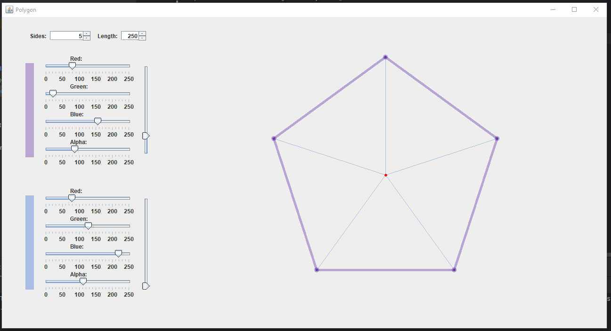
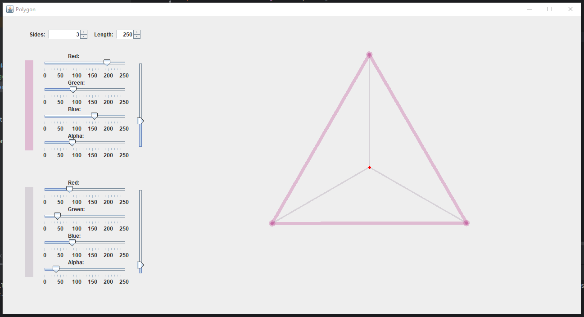
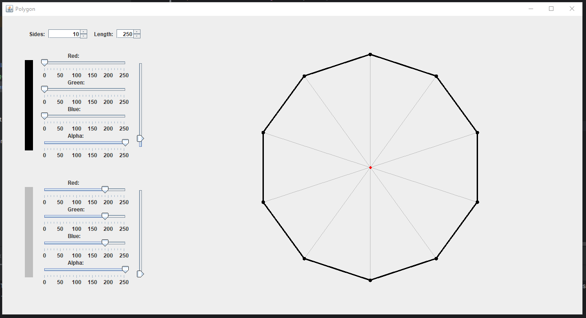
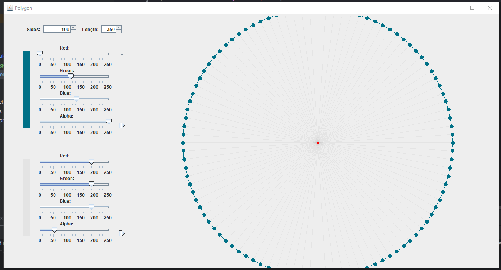
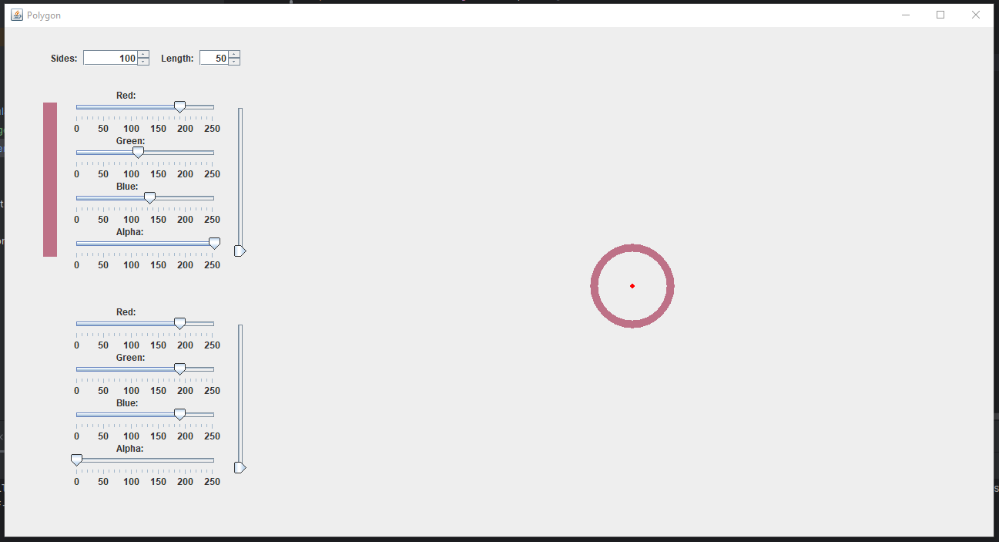
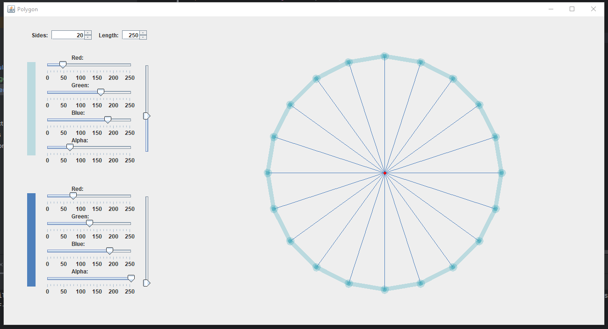

# Polygons generator

> ### Description:
> The program draws a polygon based on the specified number of sides and line length. The user can also
> change the colors or thickness of the lines. 

### Backstory:

Solving math problems really calms me down, so math is a special interest of mine. I had this weekend off,
and I became curious about how exactly programs generate polygons. Sure, I _could_ just Google it, _BUT_...

I was incredibly curious to challenge myself and figure out all the necessary formulas on my own, relying solely on
what I learned in school. Now I need a new Math project idea.

> ### About project:
> * Created in two days.
> * It uses only Java Swing. I've never worked with “pure” Java Swing before, and I was really curious to give it a try.
> * I tried to implement JColorChooser, but no matter how hard I tried, it overloaded the interface and was too wide, so
    I decided to create my own element from scratch.
> * Constants implemented via an interface.

## More about project:

* This project was created in **two days**, because I was really interested in implementations of Java UI and math is my
  special interest. And I really like the result, especially considering the time constraints, it looks really neat.
* It is a Java Swing project, and I’ve never worked with it before.
* I have experience implementing UI in Java, but I’ve used either its successors or something completely
  different (JavaFX).
* Because of this, simply implementing interface elements simultaneously with the painting method became a challenge.
  While I was working, I really missed being able to write `new Gline(x1, y1, x2, y2)`.

Project's structure:

* `Main.java` - The main file. Initializes the creation of UI and later draws the graph.
* `MathManager.java` - performs all calculations (aka vertex calculations).
* `MathFormulas.java` - consists of mathematical formulas and is used to calculate angles and transform coordinate
  systems (needed for `MathManager.java`).
* `UI.java` - creates an interface (left panel).
* `RGBChooser.java` - custom `JColorChooser`.
* Constants.java - an interface that includes all constants which are used by multiple classes.

### Can't wait to come up with more ideas for projects :D

## Images:

